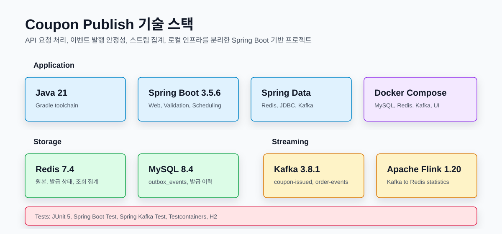
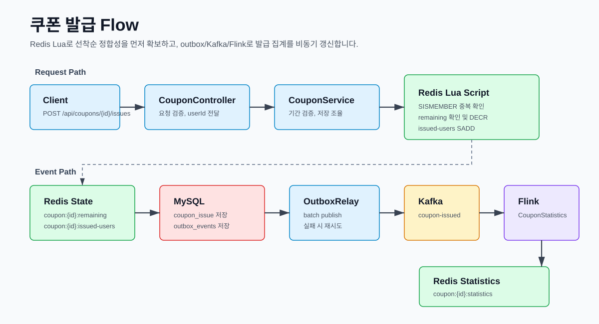
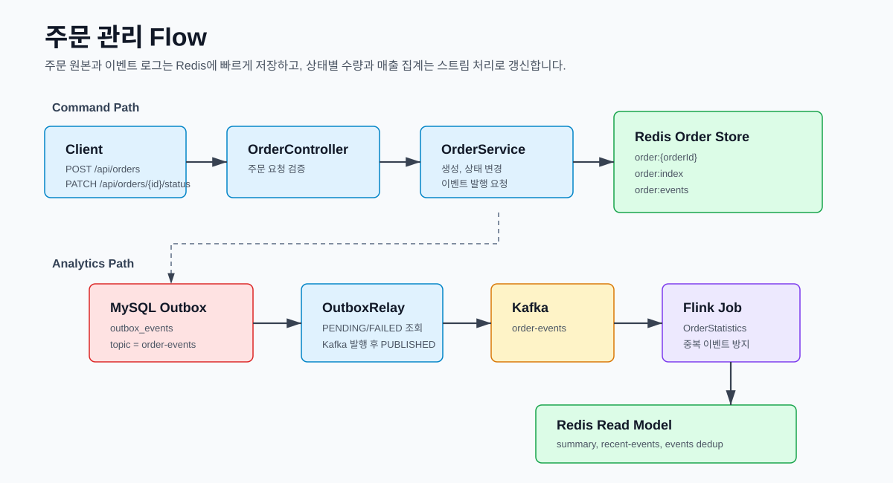
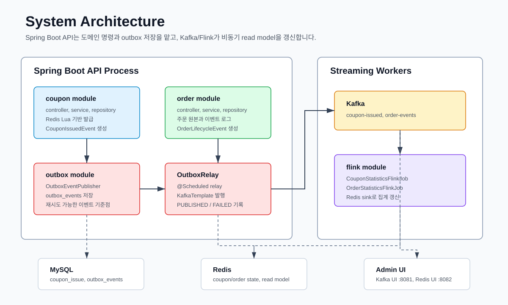

# Coupon Publish

Spring Boot, Redis, MySQL, Kafka, Apache Flink 기반의 쿠폰 발급 및 주문 관리 프로젝트입니다.

쿠폰 발급은 Redis Lua Script로 선착순 수량 차감과 중복 발급 방지를 atomic 하게 처리하고, 주문 관리는 Redis에 주문 원본과 이벤트 로그를 저장합니다. 두 도메인 모두 MySQL outbox, Kafka, Flink를 거쳐 Redis 조회용 집계를 비동기로 갱신합니다.

## Technologies



## Flow

### Coupon Issuance



```text
POST /api/coupons/{couponId}/issues
  -> Redis Lua Script로 중복 발급/남은 수량 확인 및 차감
  -> 쿠폰 발급 이력 저장
  -> MySQL outbox_events 저장
  -> OutboxRelay가 Kafka coupon-issued 발행
  -> Flink가 Redis coupon:{couponId}:statistics 갱신
```

### Order Lifecycle



```text
POST /api/orders 또는 PATCH /api/orders/{orderId}/status
  -> Redis 주문 원본 저장
  -> Redis 주문 이벤트 로그 저장
  -> MySQL outbox_events 저장
  -> OutboxRelay가 Kafka order-events 발행
  -> Flink가 Redis order:statistics:* 갱신
```

## Architecture



```text
Spring Boot API
  ├─ coupon: 쿠폰 캠페인, 발급 이력, Redis Lua 기반 발급 처리
  ├─ order: 주문 원본, 주문 이벤트 로그, 주문 조회/요약
  ├─ outbox: 이벤트 저장 및 Kafka 재시도 발행
  └─ flink: Kafka 이벤트 소비 후 Redis 집계 갱신
```

API 서버와 Flink job은 별도 프로세스로 실행합니다. API는 요청 처리와 outbox 저장까지만 담당하고, Kafka/Flink 경로가 조회용 집계를 비동기로 만듭니다.

## Project Structure

```text
src/main/java/com/couponpublish
├── coupon
│   ├── controller
│   ├── service
│   ├── repository
│   ├── event
│   └── flink
├── order
│   ├── controller
│   ├── service
│   ├── repository
│   ├── event
│   └── flink
└── outbox
    ├── OutboxEventRepository.java
    ├── OutboxEventPublisher.java
    └── OutboxRelay.java
```

## Local Run

### Docker Compose

MySQL, Redis, Kafka, Kafka UI, Redis UI를 실행합니다.

```powershell
docker compose up -d
```

API 서버:

```powershell
.\gradlew.bat bootRun
```

Flink 집계 job:

```powershell
.\gradlew.bat runCouponStatisticsFlinkJob
.\gradlew.bat runOrderStatisticsFlinkJob
```

접속 주소:

```text
API:      http://localhost:8080
Kafka UI: http://localhost:8081
Redis UI: http://localhost:8082
```

종료:

```powershell
docker compose down
```

## GitHub Actions

Workflow는 하나입니다.

- `.github/workflows/build-and-push-ghcr.yml`: 테스트 후 GHCR 이미지 빌드/푸시

## 주요 API

### Coupon

```http
POST   /api/coupons
GET    /api/coupons
GET    /api/coupons/{couponId}
DELETE /api/coupons/{couponId}

POST   /api/coupons/{couponId}/issues
GET    /api/coupons/{couponId}/issues/{userId}
GET    /api/coupons/{couponId}/issues
GET    /api/coupons/{couponId}/remaining
GET    /api/coupons/{couponId}/statistics
DELETE /api/coupons/{couponId}/issues/{userId}
```

### Order

```http
POST  /api/orders
GET   /api/orders
GET   /api/orders/{orderId}
PATCH /api/orders/{orderId}/status
GET   /api/orders/summary
GET   /api/orders/events
```

## 주요 설정

기본 설정 파일은 `src/main/resources/application.yml`입니다.

```text
Redis: localhost:6379
MySQL: localhost:3306/coupon_publish
Kafka: localhost:9092

Coupon topic: coupon-issued
Order topic: order-events
Outbox relay: enabled
```

## Test

```powershell
.\gradlew.bat test
```

전체 빌드:

```powershell
.\gradlew.bat build
```

동시성 통합 테스트는 Testcontainers로 Redis를 실행하므로 Docker가 필요합니다.
